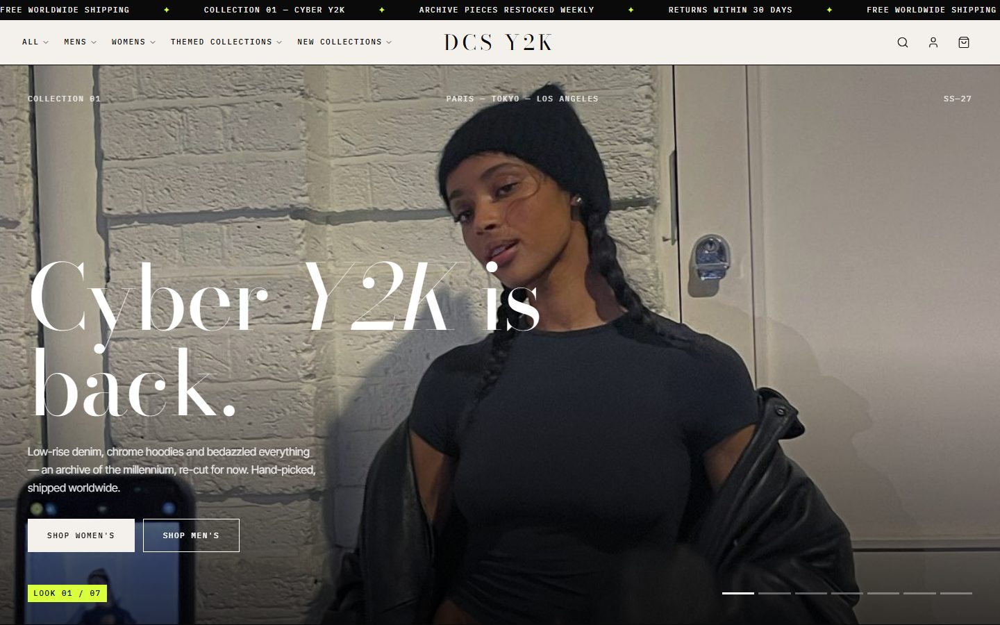
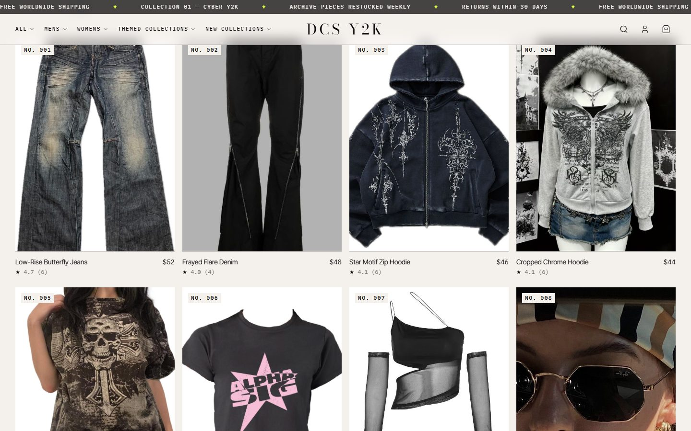
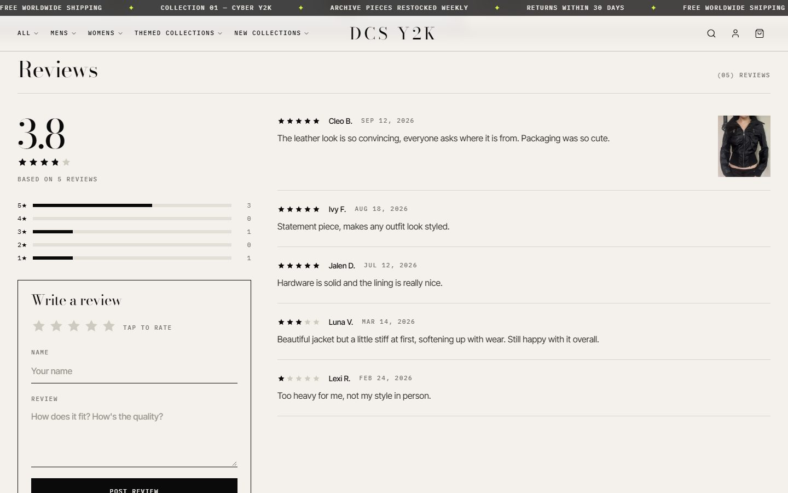
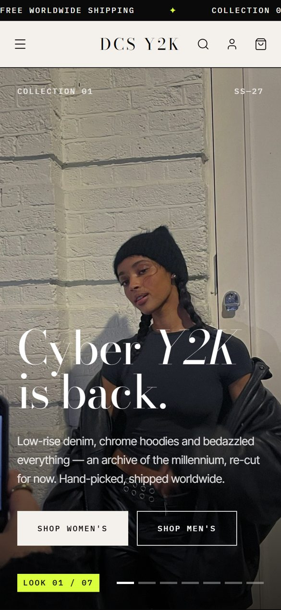
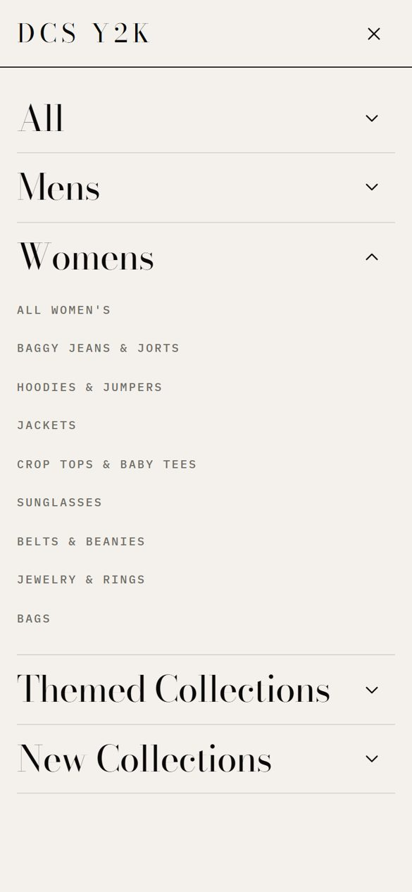
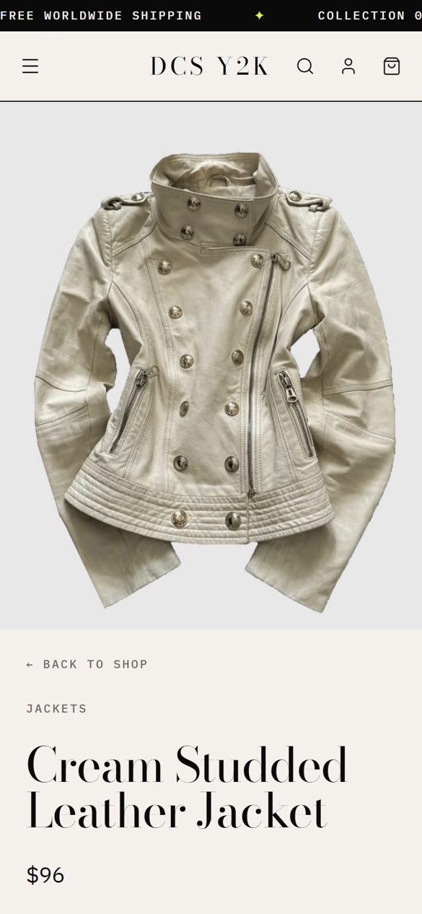

# DCS Y2K

<p align="center">
  
</p>

<p align="center">
  
  
</p>

<p align="center">
  
  
  
</p>

An editorial Y2K fashion storefront: a full-screen lookbook, a catalog of 110 pieces split by gender and category, product pages with photo reviews and a live star rating, a persistent bag, search, and a responsive layout down to phone width.

**Docs:** [Architecture](docs/ARCHITECTURE.md) · [API](docs/API.md) · [Contributing](docs/CONTRIBUTING.md)

## Stack

| Layer | Tech |
| --- | --- |
| Framework | [Astro 7](https://astro.build) (server output) with React 19 islands |
| Styling | Tailwind CSS 4, design tokens in `src/styles/global.css` |
| Client state | nanostores (bag, live ratings) |
| Database | PostgreSQL 17 via Drizzle ORM + postgres.js |
| Tests | Playwright end-to-end (desktop + mobile) |
| Hosting | Vercel, or Docker (Node server behind nginx) |

## Quick start

Requires Node ≥ 22.12 and Docker (for Postgres).

```sh
npm install
cp .env.example .env      # DATABASE_URL for the local Postgres
npm run db:up             # start Postgres in Docker
npm run db:push           # create tables
npm run db:seed           # 110 products + demo reviews
npm run dev               # http://localhost:4321
```

> If port 4321 is taken (for example by the `app` container from `docker compose up`), run `npm run dev -- --port 4323`.

## Scripts

| Command | What it does |
| --- | --- |
| `npm run dev` | Dev server with hot reload |
| `npm run build` | Production build (`dist/`, or `.vercel/output` on Vercel) |
| `npm run preview` | Serve the production build locally |
| `npm run db:up` | Start Postgres from `docker-compose.yml` |
| `npm run db:push` | Sync the Drizzle schema to the database |
| `npm run db:seed` | Replace all products and reviews with the seed data |
| `npm run test:e2e` | Run the Playwright suite (starts its own dev server on :4322) |
| `npm run test:e2e:ui` | Playwright UI mode |

## Deploy to Vercel

The adapter is chosen at build time: Vercel sets `VERCEL=1`, so its builds use `@astrojs/vercel`; everywhere else the Node adapter is used.

1. Create a Postgres database reachable from the internet (for example [Neon](https://neon.tech) or Vercel Postgres) and copy its connection string.
2. Import the repository in Vercel. Framework preset: **Astro**. No build settings need changing.
3. Add the environment variable `DATABASE_URL` (Production and Preview).
4. Create the tables and seed data once, from your machine:
   ```sh
   DATABASE_URL="postgres://…" npx drizzle-kit push
   DATABASE_URL="postgres://…" npx tsx scripts/seed.ts
   ```
5. Deploy.

On Vercel each function keeps a single database connection and skips prepared statements, so pooled connection strings (Neon `-pooler`, Supabase transaction mode) work.

## Run with Docker

```sh
docker compose up -d --build                        # db + app + nginx on http://localhost
docker compose --profile tools run --rm migrate     # create tables and seed
```

Hot-reload development in a container: `docker compose stop app && docker compose --profile dev up app-dev`.

## Project layout

```text
src/
  pages/           routes: home, shop, product/[id], [page] (help & about), legal pages, api/
  components/      Astro components and React islands (header, cart, reviews, hero slider…)
  layouts/         page shell
  lib/             catalog constants, cart store, reviews queries, page content
  db/              Drizzle schema and client
scripts/           seed data (products, demo reviews)
tests/e2e/         Playwright specs
docs/              architecture, API, contributing, screenshots
```

## Before going live

- **Demo reviews:** `scripts/reviews.ts` generates placeholder reviews. Remove them before taking real orders — fake reviews are illegal in many markets.
- **Contact address:** `CONTACT_EMAIL` in `src/lib/pages.ts` is a placeholder.
- **Images:** product and lookbook photos are hot-linked from Pinterest for the demo; replace them with images you own.
- **Accounts and checkout** are UI only — there is no backend for them yet.
