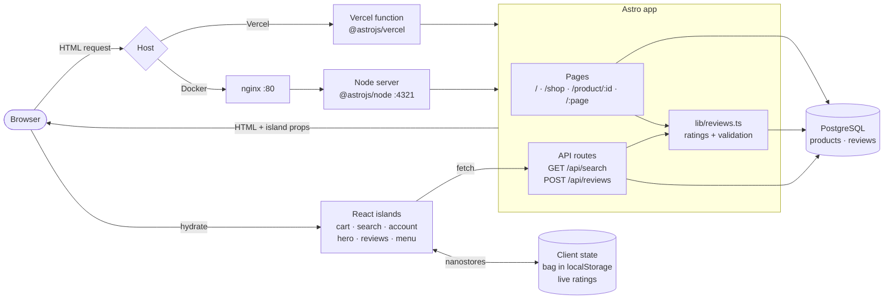
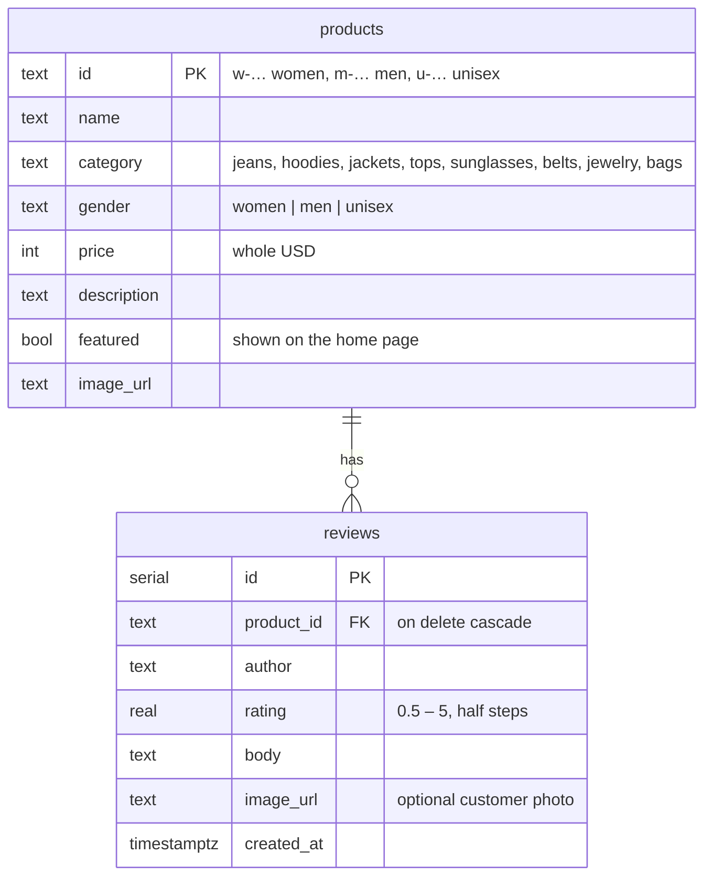
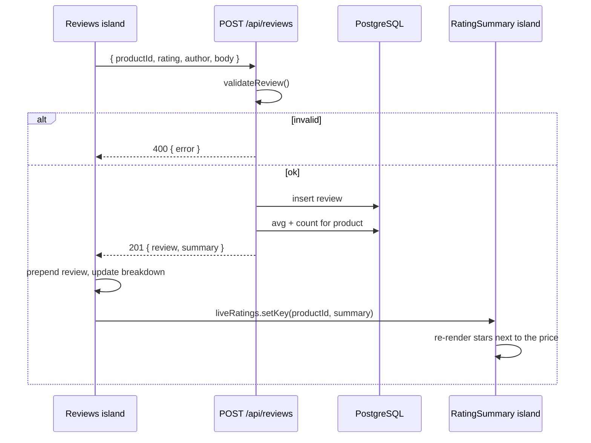

# Architecture

DCS Y2K is a server-rendered Astro app. Every page is rendered on request from PostgreSQL; interactive parts (bag, search, account modal, hero slider, reviews, mobile menu) are React islands hydrated in the browser. Navigation between pages uses Astro view transitions, so the header and the bag drawer persist without a full reload.

## Request flow

## Pages

| Route | Source | Data |
| --- | --- | --- |
| `/` | `src/pages/index.astro` | featured products + their ratings |
| `/shop` | `src/pages/shop.astro` | products filtered by `gender`, `category`, `q` |
| `/product/:id` | `src/pages/product/[id].astro` | product, 4 related items of the same gender, reviews |
| `/:page` | `src/pages/[page].astro` | help & about content from `src/lib/pages.ts`; 404 for unknown slugs |
| `/privacy-policy`, `/terms-of-service`, `/cookie-policy` | static Astro pages | — |

Filtering is done in SQL. A gender filter returns that gender plus `unisex`; the seed currently assigns every product a gender, so both sides stay strictly separate.

## Data model

A product's rating is never stored. `ratingSummaries()` in `src/lib/reviews.ts` computes the average and count with one grouped query, so it is always live.

## Posting a review

## Client state

- **Bag** — `src/lib/cart.ts`. A nanostore mirrored to `localStorage` (`y2k-cart`). The drawer is `transition:persist`, so it survives page navigation.
- **Live ratings** — `src/lib/reviewStore.ts`. Lets the reviews block at the bottom of the product page update the rating next to the price.

## Performance notes

- Links prefetch on hover (`prefetch` in `astro.config.mjs`).
- Only the clicked product card gets a `view-transition-name`; naming every card made the browser snapshot ~100 images per navigation.
- Modals and the mobile menu render through a portal into `<body>`: the header uses `backdrop-filter` once the page scrolls, which would otherwise trap `position: fixed` children inside it.
- The product page runs its related-items and reviews queries in parallel.

## Deployment targets

| Target | Adapter | Entry |
| --- | --- | --- |
| Vercel | `@astrojs/vercel` (selected when `VERCEL=1`) | `.vercel/output` |
| Docker / any Node host | `@astrojs/node` standalone | `node dist/server/entry.mjs` |

In Docker, nginx caches hashed `/_astro/` assets forever and proxies everything else to the Node server. `docker-compose.yml` pins the project name to `shop` so the database volume (`shop_pgdata`) is reused regardless of the folder name.
